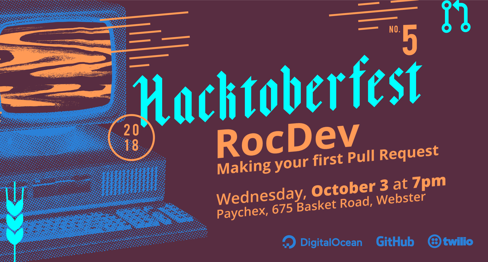

footer: George Adams (@geowa4)
slidenumbers: true
slide-dividers: #, ##

#

[.footer: ]

[.slidenumbers: false]



## Goals

- Introduction to Open Source
- Introduction to GitHub and Pull Requests
- Get free shirts!

## Open Source

- Developed for everyone to see
- Licensed to include the source code
- Collaborative

## Open Source

- Educational
- Foundation for further innovation
- "None of us is as smart as all of us."

## Licensing

This is what makes your source open.

^I am not a lawyer.

## Choosing a License

- Permissive?
- Do you care about patents?
- Viral?
- Fitting in?

[https://choosealicense.com/](https://choosealicense.com/)

^Permissive: let anyone do whatever they want with the code.

^Patents: must contributors grant use of patents they hold?

^Viral: should derivative works also be open source?

^Fitting in: what do other projects in this language or domain use?

## [fit] Enough, let's make a

### [fit] Pull Request

## What you'll need

- [GitHub account](https://github.com/join)
- [Register for Hacktoberfest](https://hacktoberfest.digitalocean.com/)

## Quick ways to find some places to start

- [Hacktoberfest @ Digital Ocean](https://hacktoberfest.digitalocean.com/)
- [Search of Github for Easy Hacktoberfest Issues](https://github.com/search?q=label%3Ahacktoberfest+label%3Aeasy+state%3Aopen+type%3Aissue&type=Issues)
- [Up For Grabs](https://up-for-grabs.net/)

## How This Was Made

Brian Boucheron (@beardicus) made rocdev-hacktoberfest.png.

```bash
convert rocdev-hacktober.png -crop 0x0+150+0 rocdev-hacktoberfest-cropped.png
```

[Deckset](https://www.deckset.com/)

## Attendees

- Dennis Wheeler
